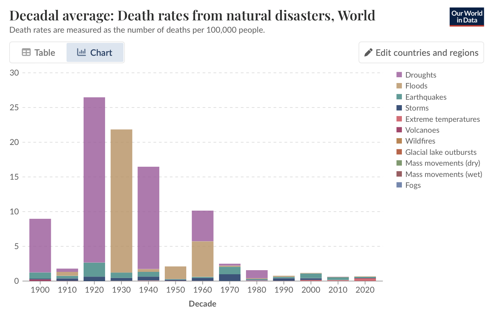
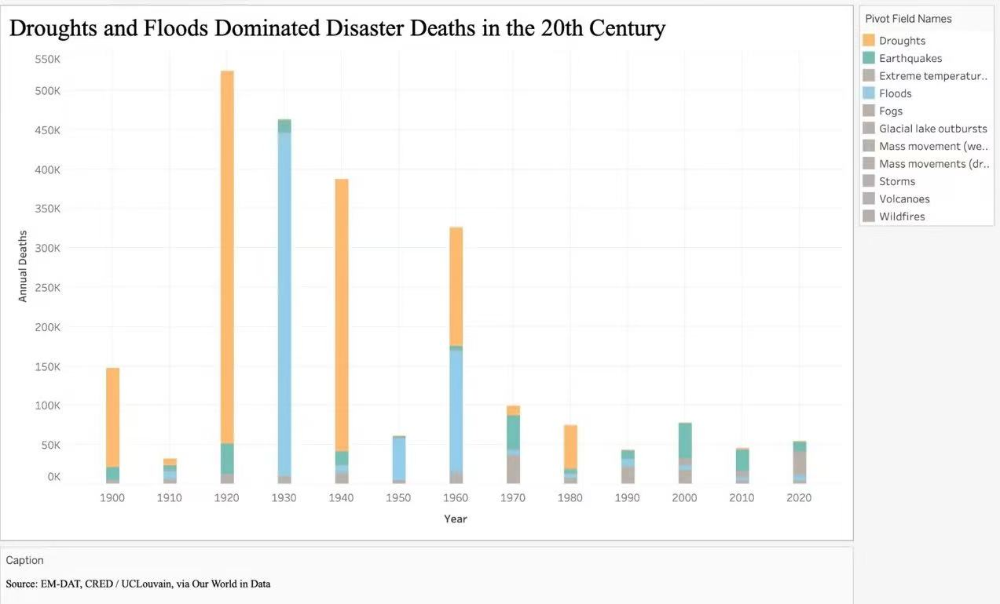

| [home page](https://cmustudent.github.io/tswd-portfolio-templates/) | [data viz examples](dataviz-examples) | [critique by design](critique-by-design) | [final project I](final-project-part-one) | [final project II](final-project-part-two) | [final project III](final-project-part-three) |

# Critique by Design: Natural Disaster Deaths

## Step one: the visualization

Original visualization: [Decadal average: Number of deaths from natural disasters, World](https://ourworldindata.org/natural-disasters) 

Source: Our World in Data, EM-DAT, CRED / UCLouvain (2025)

I selected this chart because it covers a topic that is globally relevant and visually striking. The original chart uses a stacked bar chart with 11 different colors to show annual average disaster deaths by type from 1900 to 2020. I was immediately drawn to it because while the overall downward trend in deaths is clear, the excessive number of colors made it very difficult to understand which types of disasters were driving the changes. I wanted to redesign it to tell a clearer and more specific story about how the nature of disaster deaths has shifted over the past century.

## Step two: the critique

I completed the Stephen Few Data Visualization Effectiveness Profile for this chart. The chart scored well on truthfulness and usefulness, the data comes from a reliable source and the overall downward trend in deaths is 
clear. However, it scored poorly on perceptibility and intuitiveness. The use of 11 different colors, many of which are visually similar shades of grey and brown, makes it nearly impossible to distinguish individual disaster types within the stacked bars. Additionally, the title is purely descriptive and does not guide the reader toward any particular insight. The chart communicates the total trend effectively but fails to show how the composition of disaster deaths has changed over time.

## Step three: Sketch a solution

Based on my critique, I built an initial draft in Tableau using the same stacked bar chart format as the original, but with significant simplifications. I reduced the color scheme to highlight only three key disaster types: Droughts (orange), Floods (blue), and Earthquakes (teal) — while keeping all other categories in grey. I also rewrote the title to make a clear argument: "Droughts and Floods Dominated Disaster Deaths in the 20th Century." This version kept the absolute death numbers on the Y axis, making the dramatic decline in total deaths visible.

## Step four: Test the solution

| Question | Interview 1 (from AI-MSE) | Interview 2 (from MISM ) |
|----------|-------------|-------------|
|  Can you tell me what you think this is?        |      A chart showing disaster deaths over time by type       |     A chart about how different disasters have killed people across decades        |
|  Is there anything surprising or confusing?      |     The stacking order is confusing, colored categories should be at the bottom        |    The chart shows total deaths well but doesn't show how the proportions changed         |
|    Is there anything you would change?      |     Move colored categories to the bottom for easier comparison        |    Focus more on showing the shift in proportions rather than absolute numbers may be better         |

Synthesis: 
Both interviewees understood the overall downward trend in deaths. However, a key insight emerged from the second interviewee: showing absolute numbers was less effective at communicating the most interesting story, that the 
types of disasters killing people have fundamentally changed. The first interviewee also pointed out that the stacking order made comparisons difficult. Based on this feedback, I decided to switch to a 100% stacked bar chart, which would show the share of deaths by disaster type rather than absolute numbers, making the compositional shift much clearer.

## Step five: build the solution

Taking the feedback into account, I rebuilt the visualization as a 100% stacked bar chart. I also grouped all minor disaster categories into a single "other" category, reducing the color count from 11 to 4. The chart clearly 
shows that in the early 20th century, Droughts and Floods dominated disaster deaths, while in recent decades their share has dropped dramatically. This tells a story of human progress in disaster resilience that the original 
chart obscures behind too many colors and categories.

<noscript></noscript><object class='tableauViz'  style='display:none;'><param name='host_url' value='https%3A%2F%2Fpublic.tableau.com%2F' /> <param name='embed_code_version' value='3' /> <param name='site_root' value='' /><param name='name' value='TheCompositionofDisasterDeathsHasShiftedOverthePastCentury&#47;Sheet2' /><param name='tabs' value='no' /><param name='toolbar' value='yes' /><param name='static_image' value='https:&#47;&#47;public.tableau.com&#47;static&#47;images&#47;Th&#47;TheCompositionofDisasterDeathsHasShiftedOverthePastCentury&#47;Sheet2&#47;1.png' /> <param name='animate_transition' value='yes' /><param name='display_static_image' value='yes' /><param name='display_spinner' value='yes' /><param name='display_overlay' value='yes' /><param name='display_count' value='yes' /><param name='language' value='en-US' /></object>

## References

Our World in Data. "Natural Disasters." 
https://ourworldindata.org/natural-disasters
EM-DAT, CRED / UCLouvain (2025). International Disaster Database.

## AI acknowledgements

No AI tools were used in completing this assignment.

