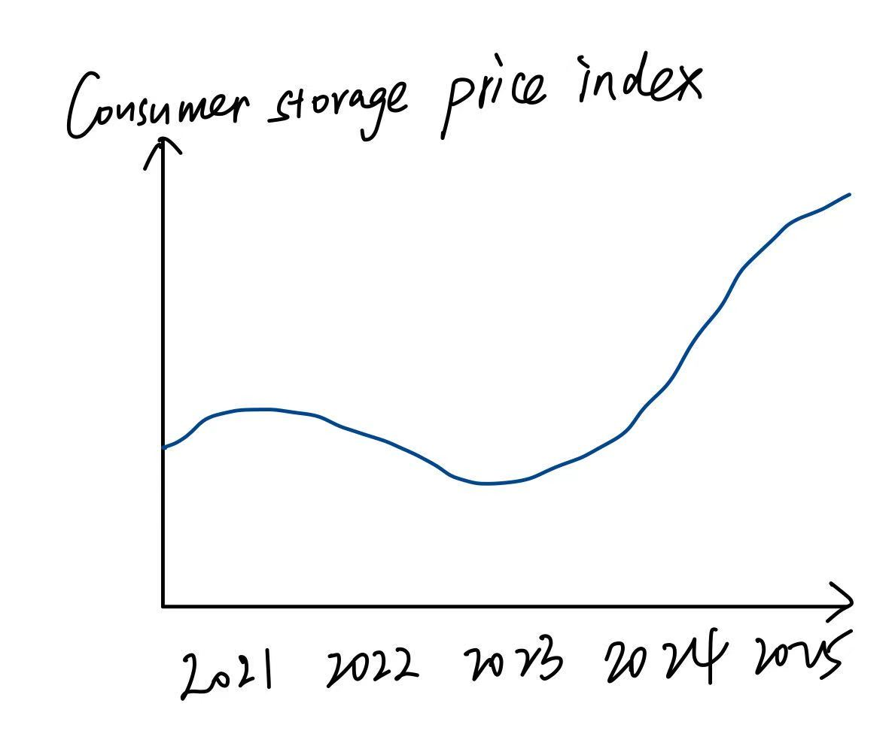
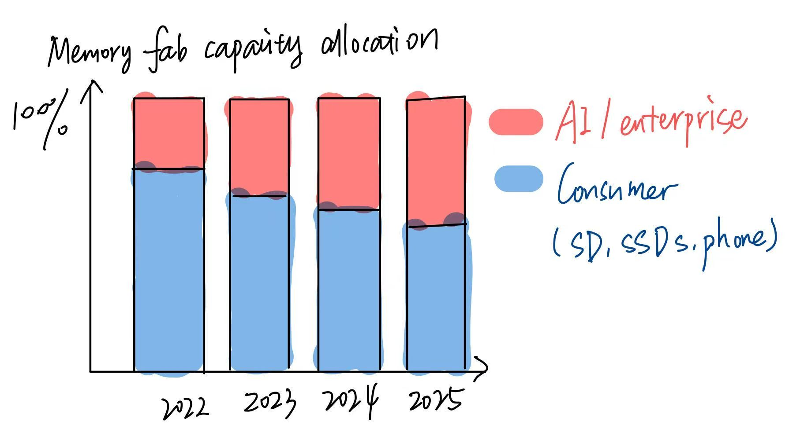

| [home page](https://cmustudent.github.io/tswd-portfolio-templates/) | [data viz examples](dataviz-examples) | [critique by design](critique-by-design) | [final project I](final-project-part-one) | [final project II](final-project-part-two) | [final project III](final-project-part-three) |

# Outline
If you have bought an SD card recently, you might have noticed that the same 128GB card you picked up a couple of years ago now costs three times as much, and stock is limited. This isn't a fluke, and it's not just inflation. Something structural shifted in the memory chip market, and it started with AI.

This project tells the story of how the explosion in AI infrastructure, including data centers, GPU clusters, and large 
language models, quietly drained the global supply of NAND flash memory. These are the same chips that go into your SD cards, SSDs, and USB drives. When companies like Microsoft, Google, and Amazon started racing to build AI servers, chipmakers like Samsung and Micron shifted their production toward high-margin enterprise memory. Consumer-grade memory got deprioritized. Supply tightened. Prices went up. And most people had no idea why.

**Setup:** Prices for everyday storage such as SD cards and SSDs have risen sharply since 2023. Many consumers noticed but could not explain it.

**Conflict:** The memory chip market runs on limited fab capacity. When AI demand surged, manufacturers reallocated wafers toward high-bandwidth memory for AI accelerators. This is a zero-sum game: every chip made for an AI server is one less chip for a consumer product.

**Resolution:** This shortage is not going away soon. New fabs will not come online until 2027 at the earliest. The goal of this project is to make that invisible supply chain visible and help everyday consumers understand why their tech is getting more expensive.

## Initial sketches
The following sketches outline the key visualizations planned for this project.

**Sketch 1** shows the consumer NAND price index from 2021 to 2025, 
highlighting the sharp rise that began in late 2023 as AI demand 
started crowding out consumer supply.

**Sketch 2** shows how memory fab capacity allocation has shifted 
over the same period, with an increasing share going to AI and 
enterprise workloads at the expense of consumer products.

# The data
The primary data for this project comes from industry sources that track memory chip pricing and manufacturing capacity. NAND flash and DRAM price trends are sourced from TrendForce, a semiconductor market research firm that publishes regular pricing reports. Retail-level price changes for consumer storage products such as SSDs and SD cards are documented through Tom's Hardware, which has tracked specific product prices over time. For the supply-side story, the IDC report on the global memory shortage provides analysis on how manufacturers have reallocated wafer capacity toward AI and enterprise workloads. These sources together allow the project to connect the macro shift in chip manufacturing to the price increases that everyday consumers actually experience.

The data will be used to build three main visualizations: a price trend line showing the rise in consumer storage costs , a capacity allocation chart showing the growing share going to AI workloads, and a supply chain diagram illustrating the zero-sum competition between AI data centers and consumer products.

| Name | URL | Description |
|------|-----|-------------|
| TrendForce NAND Flash Price Trends | https://www.trendforce.com/price/flash | Quarterly NAND contract and spot price data |
| Tom's Hardware storage price tracking | https://www.tomshardware.com | Retail SSD and storage price reporting |
| IDC Global Memory Shortage Report | https://www.idc.com/resource-center/blog/global-memory-shortage-crisis-market-analysis-and-the-potential-impact-on-the-smartphone-and-pc-markets-in-2026/ | Analysis of AI-driven memory reallocation and consumer impact |
| IntuitionLabs RAM Shortage 2025 | https://intuitionlabs.ai/articles/ram-shortage-2025-ai-demand | Overview of AI demand and DRAM price surge |

# Method and medium
This project will be built using Shorthand as the primary storytelling platform, with data visualizations created in Tableau. The final deliverable will be a scrollable, interactive web story that guides the reader from the personal observation of rising SD card prices through to the broader supply chain explanation. Shorthand's scroll-based format suits this project well because the story has a clear beginning, middle, and end that benefits from a linear reading experience.

## References
TrendForce. "NAND Flash Price Trends." Accessed April 2026. 
https://www.trendforce.com/price/flash

Tom's Hardware. "Perfect Storm of Demand and Supply Driving Up Storage Costs." Accessed April 2026. 
https://www.tomshardware.com/pc-components/storage/perfect-storm-of-demand-and-supply-driving-up-storage-costs

IDC. "Global Memory Shortage Crisis: Market Analysis and the Potential Impact on the Smartphone and PC Markets in 2026." February 2026. 
https://www.idc.com/resource-center/blog/global-memory-shortage-crisis-market-analysis-and-the-potential-impact-on-the-smartphone-and-pc-markets-in-2026/

IntuitionLabs. "RAM Shortage 2025: How AI Demand is Raising DRAM Prices." Accessed April 2026. 
https://intuitionlabs.ai/articles/ram-shortage-2025-ai-demand

## AI acknowledgements
I used Claude (Anthropic) to help identify publicly accessible datasets and sources relevant to this project.
